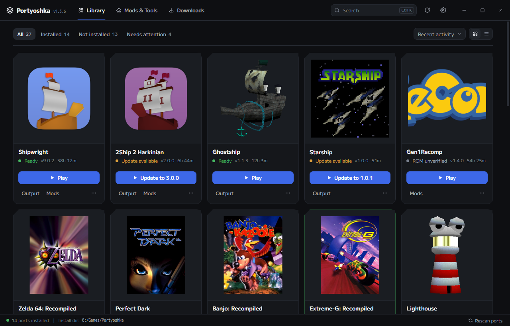

# Portyoshka

A desktop launcher for fan-made native PC ports of classic console games. Install, update, and launch ports straight from their official GitHub or GitLab releases — no manual downloading, unzipping, or fiddling with AppImages.

Built with Electron, React, TypeScript, and Zustand.

## Screenshots



> Keep this up to date when the UI changes noticeably — drop a new PNG at `screenshots/library.png` and update the embed.

## Features

- **One-click install** — picks the right release asset for your OS and platform, downloads it, verifies it, and extracts it; multiple installs queue up one at a time
- **ROM handling** — guides you through providing a legally obtained ROM for each game and validates its hash where the port publishes one
- **Updates** — checks the port's GitHub or GitLab releases and updates in place, preserving your saves and extracted game data
- **Self-updater** — Portyoshka checks its own GitHub releases on launch (and via the "Check for updates" button) and can update itself: AppImage downloads and replaces itself, Windows launches the new installer
- **Playtime tracking** — records play time per port and shows when you last played
- **Mods** — browse a mod directory with search and categories, install, update and remove mods, and jump to the mod's page (GameBanana for the HarbourMasters ports, the community index for Gen1Recomp)
- **Add to Steam** — one click adds a port to your Steam library with its icon, toggles to remove
- **Clean launches** — launches, monitors, and kills the port's processes properly (handles AppImage FUSE quirks and child processes)
- **Cross-platform** — Windows, macOS, and Linux

## Supported ports

| Port | Game | Requires |
| --- | --- | --- |
| [Shipwright](https://github.com/HarbourMasters/Shipwright) | The Legend of Zelda: Ocarina of Time | US OoT ROM (`*.z64`, SHA-1 verified) |
| [2Ship 2 Harkinian](https://github.com/HarbourMasters/2ship2harkinian) | The Legend of Zelda: Majora's Mask | US / EU MM ROM (SHA-1 verified) |
| [Ghostship](https://github.com/HarbourMasters/Ghostship) | Super Mario 64 | US or JP SM64 ROM (`*.z64`, SHA-1 verified) |
| [Starship](https://github.com/HarbourMasters/Starship) | Star Fox 64 | US 1.0 / 1.1 SF64 ROM |
| [Spaghetti Kart](https://github.com/HarbourMasters/SpaghettiKart) | Mario Kart 64 | US MK64 ROM |
| [Lighthouse](https://github.com/HarbourMasters/Lighthouse) | Banjo-Kazooie | US 1.0 / 1.1, JP, or PAL B-K ROM |
| [Dusklight](https://github.com/TwilitRealm/dusklight) | The Legend of Zelda: Twilight Princess | GameCube ISO (accepted by extension, not hash-verified) |
| [Gen1Recomp](https://github.com/bryanthaboi/gen1recomp) | Pokémon Red, Blue & Yellow | None — the game imports your US Red/Blue/Yellow (or Gold/Silver/Crystal) ROM itself through its own launcher |
| [Banjo: Recompiled](https://github.com/BanjoRecomp/BanjoRecomp) | Banjo-Kazooie | None — the game asks for the US 1.0 ROM in its own menu |
| [Bomberman 64: Recompiled](https://github.com/RevoSucks/BM64Recomp) | Bomberman 64 | None — the game asks for the US ROM in its own menu |
| [Bomberman Hero: Recompiled](https://github.com/RevoSucks/BMHeroRecomp) | Bomberman Hero | None — the game asks for the US ROM in its own menu |
| [Dinosaur Planet: Recompiled](https://github.com/DinosaurPlanetRecomp/dino-recomp) | Dinosaur Planet (prototype) | None — the game asks for the prototype ROM in its own menu |
| [Donkey Kong 64: Recompiled](https://github.com/Rainchus/Donkey-Kong-64-Recompiled) | Donkey Kong 64 | None — the game asks for the US ROM in its own menu |
| [Perfect Dark](https://github.com/perfect-dark-pc-port/perfect_dark) | Perfect Dark | NTSC US ROM (md5 verified), copied next to the game as `data/pd.ntsc-final.z64` |
| [Dr. Mario 64 Recompiled+](https://github.com/theboy181/drmario64_recomp_plus) | Dr. Mario 64 | None — the game asks for the US ROM itself at runtime |
| [Extreme-G: Recompiled](https://gitlab.com/sonicdcer/ExtremeGRecomp) | Extreme-G | None — the game asks for the US 1.0 ROM in its own menu |
| [Goemon 64: Recompiled](https://github.com/klorfmorf/Goemon64Recomp) | Mystical Ninja Starring Goemon | None — the game asks for the US ROM in its own menu |
| [Harvest Moon 64: Recompiled](https://github.com/HarvestMoon64Recomp/HarvestMoon64Recomp) | Harvest Moon 64 | None — the game asks for the US ROM in its own menu |
| [Mega Man 64: Recompiled](https://github.com/MegaMan64Recomp/MegaMan64Recompiled) | Mega Man 64 | None — the game asks for the US ROM in its own menu |
| [Quest 64: Recompiled](https://github.com/Rainchus/Quest64-Recomp) | Quest 64 | None — the game asks for the US ROM in its own menu |
| [Snowboard Kids 2: Recompiled](https://github.com/cdlewis/snowboardkids2-recomp) | Snowboard Kids 2 | None — the game asks for the US ROM in its own menu |
| [Space Station Silicon Valley: Recompiled](https://github.com/Cellenseres/SSSV_Recomp) | Space Station Silicon Valley | None — the game asks for the US 1.0 ROM in its own menu |
| [WCW vs. nWo World Tour: Recompiled](https://github.com/jessetbh/WCWvsNWOWorldTourRecomp) | WCW vs. nWo World Tour | None — the game asks for the US ROM itself |
| [WCW/nWo Revenge: Recompiled](https://github.com/jessetbh/WCWnWoRevengeRecomp) | WCW/nWo Revenge | None — the game asks for the US ROM itself |
| [Zelda 64: Recompiled](https://github.com/Zelda64Recomp/Zelda64Recomp) | The Legend of Zelda: Majora's Mask | None — the game asks for the US ROM in its own menu |

Ports are listed on the platform where they publish builds — e.g. some ports have no macOS release, so they won't appear on macOS.

## Requirements

- **A legitimate ROM dump** of each game you want to play, from your own cartridge/disc. Portyoshka never downloads or hosts game ROMs.
- Windows: nothing extra. Linux: if your distro lacks FUSE, AppImages still run (Portyoshka auto-extracts them). Ubuntu users on some ports may need `zenity`/`kdialog` for in-game ROM pickers.
- 4+ GB free disk per port — the ports and their extracted assets are large.

## Windows Smart App Control

Windows 11's Smart App Control (and SmartScreen on older Windows) can block unsigned executables. The durable fix is Authenticode code signing — signed builds pass both.

Releases are signed automatically when the repo has these secrets:

- `WINDOWS_CERT_PFX` — your code signing certificate (`.pfx`) encoded as base64
- `WINDOWS_CERT_PASSWORD` — the certificate password

The release workflow decodes the certificate and signs both the app and the installer. To sign locally instead, set `WINDOWS_CERT_FILE` (path to the `.pfx`) and `WINDOWS_CERT_PASSWORD` before `npm run make`. An EV (Extended Validation) certificate gets instant reputation; a standard one builds it over time.

For end users stuck on an unsigned dev build: right-click the downloaded file → Properties → check **Unblock**, or run it via Windows Security → App & browser control → Smart App Control settings (turning Smart App Control off is permanent on that device).

## Development

```sh
npm install
npm start          # dev run (main + preload + renderer)
npm run lint       # eslint
npm run typecheck  # tsc --noEmit
npm run smoke      # end-to-end smoke suite (downloads real releases — see below)
```

Notes:

- `npm run smoke` hits the real GitHub API and downloads actual releases, so it can fail from GitHub's 60 req/hr unauthenticated rate limit. That's a flake, not a bug — you can raise the limit by adding a GitHub token in Settings.
- Requires Node >= 22.5 with `node:sqlite` support (23.4+ recommended) and `python3` on PATH.

## Architecture

The short version:

- IPC contract: `PortyoshkaApi` + `MainEvent` in `src/shared/types.ts` → handlers in `src/main/ipc.ts` → preload bridge in `src/preload.ts` → consumed via `window.portyoshka`.
- Database: `node:sqlite` (WAL, foreign keys on), migrations are an append-only array.
- Ports: `src/main/registry/ports/`, each a `PortConfig` pointing at a GitHub or GitLab repo, its release asset glob, executable name, ROM spec, and `preserveOnUpdate` globs.

## Making a release

Releases are built and published automatically by GitHub Actions when you push a `v*` tag — and the launcher's self-updater picks them up, so users on the AppImage update in place.

### 1. Bump the version

Edit `version` in `package.json` and add a `## <version>` section to `CHANGELOG.md` (its bullets become the release notes), then commit and tag. (CI overrides the version from the tag at build time, so artifacts always match the release number — but bump it anyway so local builds are correct too.)

```sh
git tag v1.2.0
git push origin main
git push origin v1.2.0
```

Pushing a `v*` tag triggers the GitHub Actions workflow, which builds all artifacts, renames them with the OS in the filename, and publishes the GitHub Release automatically:

| Platform | File | What it is |
| --- | --- | --- |
| Windows | `Portyoshka-1.2.0-Windows-Setup.exe` | Squirrel installer |
| Linux | `Portyoshka-1.2.0-Linux.AppImage` | Portable, run on any distro (needs FUSE; Portyoshka auto-extracts the AppImages it launches) |
| Linux | `Portyoshka-1.2.0-Linux.deb` | Debian/Ubuntu package |
| Linux | `Portyoshka-1.2.0-Linux.rpm` | Fedora/RHEL package |

macOS builds are not automated yet — run `npm run make` on a Mac (the ZIP maker targets darwin).

### 2. Building locally

Each platform's installer must be built **on that platform** (Squirrel needs Windows, `.deb`/`.rpm`/AppImage need Linux):

```sh
npm install
npm run make
```

Artifacts land in `out/make/`. Building the AppImage locally needs `mksquashfs` on PATH (`squashfs-tools` package: `sudo pacman -S squashfs-tools` on Arch/CachyOS, `sudo apt install squashfs-tools` on Debian/Ubuntu).

### 3. Create the GitHub Release (manual fallback)

The workflow publishes releases automatically. If you do it by hand instead:

1. Push the tag, then go to **Releases → Draft a new release** (or use `gh release create`).
2. Choose the tag, title it `v1.2.0`.
3. Attach every artifact from `out/make/`.
4. Publish. Users install the right artifact for their OS.

### Known caveats

- **Unsigned binaries**: without code signing, Windows shows a SmartScreen "unknown publisher" warning and macOS shows a "damaged/unverified" warning (users right-click → Open). Electron Forge also warns about the missing `authors` field. This is expected for a hobby project; signing certificates can be added later.
- **Electron binary bloat**: the download of `electron` in CI is large (~100 MB per platform) — builds take a few minutes.
- **Test before tagging**: run `npm run lint`, `npm run typecheck`, and `npm run smoke` on the same machine before cutting the tag.

## Legal

Portyoshka is an unofficial fan project. It is not affiliated with Nintendo, or with the port projects' authors — it merely downloads their releases from GitHub/GitLab and helps you run them. Game ROMs are not distributed; you must provide your own legally obtained copies. This project is MIT licensed; see the port projects' licenses for their terms.
